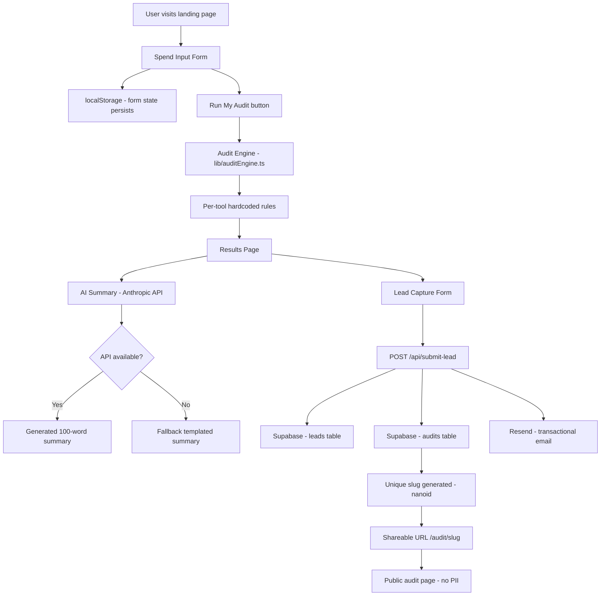

# Architecture

## System Diagram

## Data Flow

1. **User inputs** — team size, use case, tools with plan/seats/spend
2. **localStorage** — form state saved on every change, survives page reload
3. **Audit engine** — pure TypeScript function, no API calls, deterministic
4. **Results** — rendered client-side from audit engine output
5. **Lead capture** — POST to /api/submit-lead with email + audit data
6. **Supabase** — leads stored with full audit data, audits stored with slug
7. **Resend** — confirmation email sent with share link
8. **Shareable URL** — /audit/[slug] fetches from Supabase, strips PII

## Stack Decisions

### Next.js + TypeScript
Chose Next.js because:
- API routes built-in — no separate backend needed
- Vercel deployment is one-click
- App Router gives clean file-based routing for /audit/[slug]
- TypeScript catches bugs at compile time — important for financial logic

### Supabase
Chose Supabase because:
- Free tier generous enough for this use case
- Built-in Postgres — structured data for leads
- REST API auto-generated — no ORM setup needed
- Dashboard makes it easy to verify data during development

### Tailwind CSS
Chose Tailwind because:
- Rapid prototyping — no context switching between files
- Consistent design tokens out of the box
- No runtime CSS — good for Lighthouse scores

### Resend
Chose Resend because:
- Free tier: 3000 emails/month
- Simple API — 5 lines to send an email
- Good deliverability vs raw SMTP

### Hardcoded audit rules vs AI
The audit engine uses hardcoded rules, not AI. This is intentional:
- Financial recommendations must be deterministic and auditable
- AI output varies — a finance person needs to trust the numbers
- AI is used only for the narrative summary layer, not the math

## Scaling to 10,000 Audits/Day

Current architecture would break at scale. Changes needed:

1. **Database** — Add connection pooling via Supabase pgBouncer
2. **API routes** — Move to edge functions for lower latency globally
3. **Rate limiting** — Add Redis-based rate limiting (Upstash)
4. **Email** — Resend free tier caps at 3k/month — upgrade or move to SES
5. **Caching** — Cache audit results for identical inputs using Redis
6. **CDN** — Static assets already on Vercel CDN — no change needed
7. **Monitoring** — Add Sentry for error tracking, Vercel Analytics for traffic