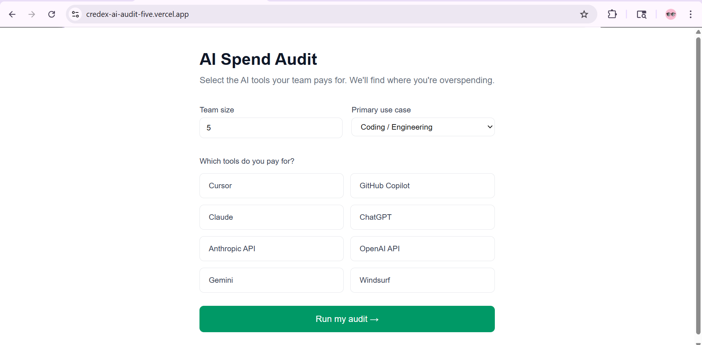
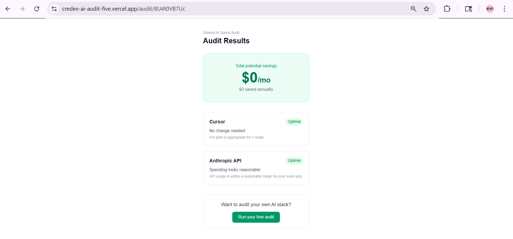

# AI Spend Audit — Free AI Tool Cost Optimizer

A free web app that audits your team's AI tool subscriptions and identifies
where you're overspending. Built as a lead-generation asset for
[Credex](https://credex.rocks) — a marketplace for discounted AI credits.

**Live URL:** https://credex-ai-audit-five.vercel.app

---

## Screenshots







---

## Who It's For

Engineering managers and CTOs at startups (10-50 people) who approved
AI tool subscriptions months ago and haven't revisited the bill since.
Also useful for solo founders paying for overlapping AI tools.

---

## Quick Start

### Run Locally

```bash
git clone https://github.com/krishna729/credex-ai-audit
cd credex-ai-audit
npm install
```

Create `.env.local`:
```
NEXT_PUBLIC_SUPABASE_URL=your_supabase_url
NEXT_PUBLIC_SUPABASE_ANON_KEY=your_anon_key
SUPABASE_SERVICE_ROLE_KEY=your_service_role_key
NEXT_PUBLIC_APP_URL=http://localhost:3000
RESEND_API_KEY=your_resend_key
```

```bash
npm run dev
```

Open http://localhost:3000

### Run Tests

```bash
npm test
```

### Deploy

Push to main — Vercel auto-deploys via GitHub integration.

---

## Decisions

**1. Hardcoded audit rules instead of AI for the math**
The audit engine uses deterministic TypeScript rules, not LLM calls.
Financial recommendations must be consistent and auditable. A finance
person should read the logic and agree. AI is only used for the
narrative summary layer on top.

**2. Next.js App Router over Pages Router**
App Router gives cleaner file-based routing for /audit/[slug] and
built-in API routes. No separate backend needed. Vercel deployment
is one-click.

**3. Supabase over Firebase**
Supabase gives a real Postgres database — better for structured lead
data. Firebase is NoSQL which is overkill for this use case. Supabase
free tier is generous and the dashboard is easy to verify data.

**4. Email capture after value shown, never before**
Assignment requirement and good UX practice. Showing savings first
builds trust. Asking for email before showing results kills conversion.

**5. nanoid for shareable slugs over UUID**
nanoid generates shorter, URL-friendly slugs (10 chars vs 36 for UUID).
Better for shareable URLs that people will actually copy and paste.

---

## Tech Stack

- **Frontend:** Next.js 16, TypeScript, Tailwind CSS
- **Backend:** Next.js API Routes
- **Database:** Supabase (Postgres)
- **Email:** Resend
- **Deploy:** Vercel
- **Tests:** Jest + ts-jest
- **CI:** GitHub Actions

---

## Repo Structure

```
credex-ai-audit/
├── app/
│   ├── page.tsx              # Home — spend input form
│   ├── audit/
│   │   ├── results/page.tsx  # Audit results + lead capture
│   │   └── [slug]/page.tsx   # Shareable public audit page
│   └── api/
│       └── submit-lead/      # Lead capture + email API
├── components/
│   └── SpendForm.tsx         # Multi-tool input form
├── lib/
│   ├── auditEngine.ts        # Core audit logic
│   └── tools.ts              # Tool config and plans
├── types/
│   └── index.ts              # TypeScript types
├── __tests__/
│   └── auditEngine.test.ts   # 7 passing tests
└── .github/
    └── workflows/ci.yml      # GitHub Actions CI
```